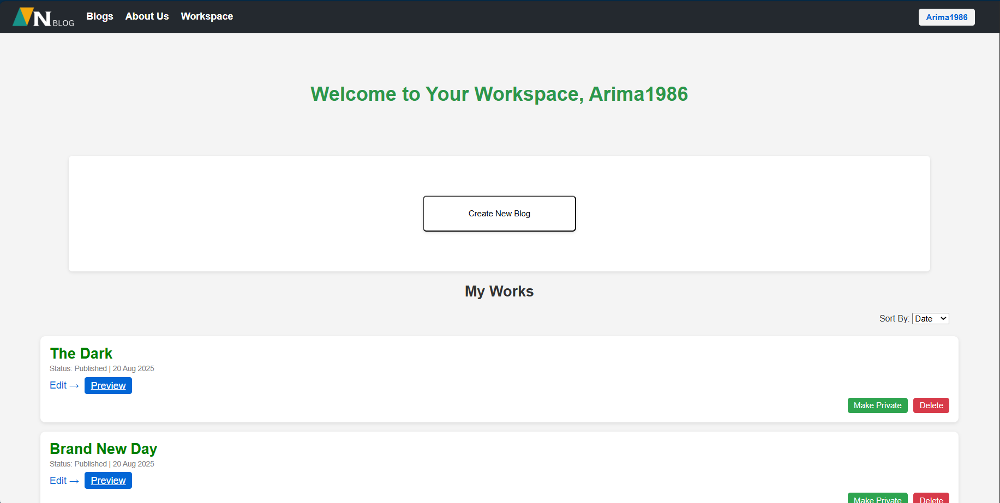
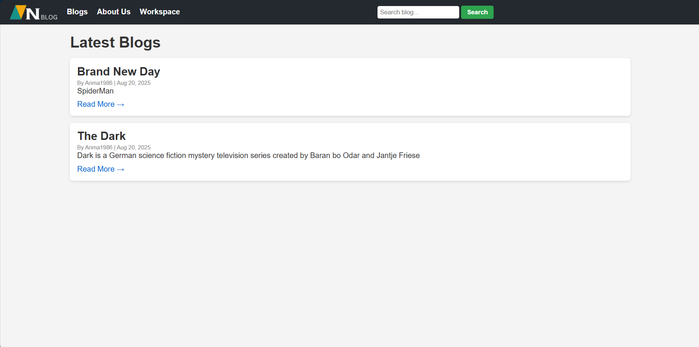
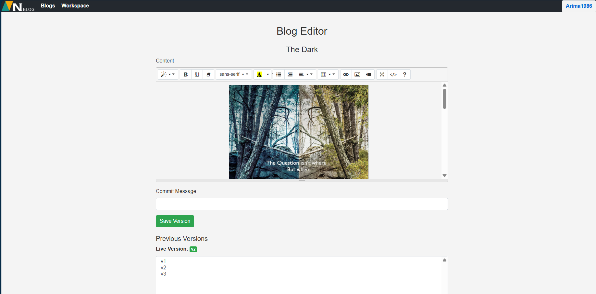

Blog Management System

A Collaborative Blogging Platform built using ASP.NET Web Forms, C#, ADO.NET & SQL Server

🚀 Introduction

The Blog Management System is a full-stack .NET mini-project designed to allow users to:

Create blogs

Write beautiful HTML-formatted content

Collaborate with other users

Submit drafts and request approvals

Publish blogs for the public or keep them private

It is built using:

ASP.NET Web Forms (UI)

C# (Business Logic)

ADO.NET (Database Layer)

SQL Server (Database)

This project is perfect for academic submissions, mini-projects, and learning .NET full-stack development.

🧱 Project Architecture
Three-Layer Architecture
Presentation Layer (ASP.NET Web Forms)
Business Logic Layer (C# Class Libraries)
Data Access Layer (ADO.NET + SQL Server)

Content Storage

Blog content is saved as .html files

File paths are stored in SQL Server

Ensures fast rendering and lower DB load

🏗 Database Creation Script
CREATE DATABASE Blog_Management;
GO
USE Blog_Management;
GO

🗄 Database Schema (Final)

The system uses 4 main tables:

Users – Stores user accounts

Blogs – Stores blog metadata and content file path

Collaborators – Handles collaboration between users

BlogDrafts – Stores draft file paths for approval

🟥 1. Users Table
CREATE TABLE Users (
    UserID INT PRIMARY KEY IDENTITY,
    Username NVARCHAR(200) NOT NULL UNIQUE,
    Email NVARCHAR(510) NOT NULL UNIQUE,
    PasswordHash NVARCHAR(510) NOT NULL,
    IsActive BIT NULL,
    CreatedAt DATETIME DEFAULT GETDATE()
);

Columns
Column	Type	Description
UserID	int	Primary key
Username	nvarchar	Unique username
Email	nvarchar	Unique email
PasswordHash	nvarchar	Password hash
IsActive	bit	Soft delete
CreatedAt	datetime	Timestamp
🟦 2. Blogs Table
CREATE TABLE Blogs (
    BlogID INT PRIMARY KEY IDENTITY,
    UserID INT NOT NULL,
    Title NVARCHAR(510) NOT NULL,
    Description NVARCHAR(MAX) NOT NULL,
    IsPublished BIT NULL,
    CreatedAt DATETIME DEFAULT GETDATE(),
    UpdatedAt DATETIME NULL,
    IsActive BIT NULL,

    FOREIGN KEY (UserID) REFERENCES Users(UserID)
);

Columns
Column	Type	Description
BlogID	int	Primary Key
UserID	int	FK to Users
Title	nvarchar	Blog title
Description	nvarchar(max)	Blog content/summary
IsPublished	bit	Publish status
CreatedAt	datetime	Creation time
UpdatedAt	datetime	Last update
IsActive	bit	Soft delete
🟩 3. Collaborators Table
CREATE TABLE Collaborators (
    CollaboratorID INT PRIMARY KEY IDENTITY,
    BlogID INT NOT NULL,
    UserID INT NOT NULL,
    AddedAt DATETIME DEFAULT GETDATE(),

    FOREIGN KEY (BlogID) REFERENCES Blogs(BlogID),
    FOREIGN KEY (UserID) REFERENCES Users(UserID)
);

Purpose

Allows multiple collaborators for each blog

Collaborators can request access or be added by owner

🟨 4. BlogDrafts Table
CREATE TABLE BlogDrafts (
    DraftID INT PRIMARY KEY IDENTITY,
    BlogID INT NOT NULL,
    UserID INT NOT NULL,
    DraftFile NVARCHAR(500) NOT NULL,
    Status NVARCHAR(20) CHECK (Status IN ('Pending','Approved','Rejected')),
    CreatedAt DATETIME DEFAULT GETDATE(),

    FOREIGN KEY (BlogID) REFERENCES Blogs(BlogID),
    FOREIGN KEY (UserID) REFERENCES Users(UserID)
);

🔗 ER Diagram (Summary)
Users (1) ---- (M) Blogs
Users (1) ---- (M) Collaborators
Blogs (1) ---- (M) Collaborators
Blogs (1) ---- (M) BlogDrafts

🧭 Complete Project Workflow
1️⃣ User Registration & Login

Anyone can create an account

Users can read blogs or create their own

2️⃣ Blog Creation

User creates a new blog → becomes the Owner

3️⃣ Blog Writing

Using the Rich Text Editor, owner writes blog content
Content saved as HTML in:

/ContentFiles/blogs/

4️⃣ Privacy Control

Blogs can be:

✔ Public

Everyone can read
Readers can request collaboration

✔ Private

Only owner + approved collaborators can access

5️⃣ Collaboration Workflow

Collaborators can:

Request edit permission

Submit a draft

Wait for approval

6️⃣ Draft Approval

Owner reviews:

Approve → draft replaces blog HTML file

Reject → draft stored but not applied

7️⃣ Publishing

Owner can:

Publish

Unpublish

Edit content anytime

🖥 Pages Explained
🏠 1. Workspace Page (Workspace.aspx)
Purpose

The main dashboard after login.

Shows

Blogs owned by the user

Blogs user collaborates on

Public blogs

Pending draft requests

Actions

Create Blog

Edit Blog

Add Collaborator

Approve Draft

Publish / Unpublish

Screenshot

📚 2. Blogs Page (Blogs.aspx)
Purpose

Displays all blogs accessible to the user.

Shows

Title

Description

Owner

Publish status

Privacy

Actions

Read Blog

Request Collaboration

View Details

Screenshot

✍️ 3. Blog Editor Page (BlogEditor.aspx)
Purpose

Page for writing and editing blog content.

Features

Rich text editor (TinyMCE/CKEditor)

Upload images

Save draft

Submit draft (collaborator)

Publish / Update (owner)

Workflow
User	Action
Owner	Writes blog → saves directly
Collaborator	Submits draft → waits approval
Owner	Approves → replaces HTML file
Screenshot

🔚 Summary

The Blog Management System provides:

Blog creation & publishing

Private and public controls

Collaboration & approval workflows

Rich text editing via web

SQL Server storage with HTML rendering

Clean 3-tier architecture

This is an excellent academic mini-project demonstrating:

✔ ADO.NET
✔ ASP.NET Web Forms
✔ SQL Server
✔ Rich Editor Integration
✔ Multi-user collaboration